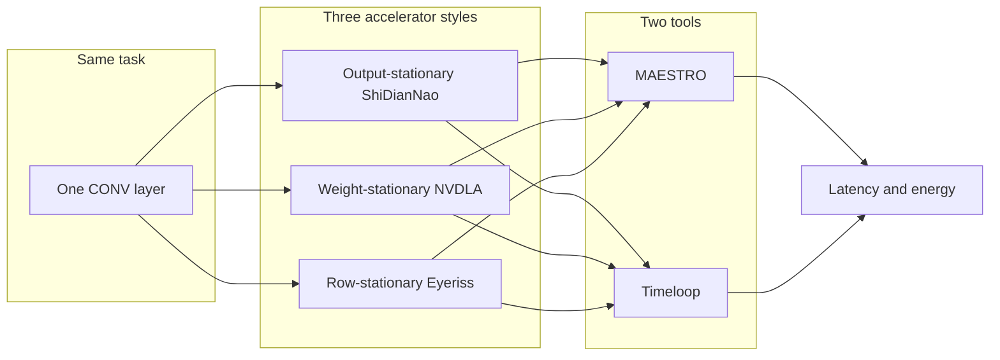
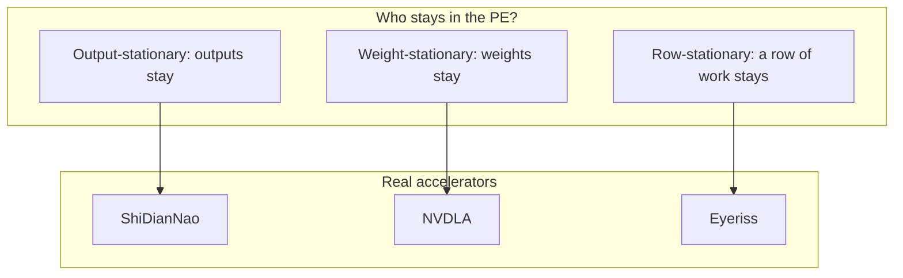
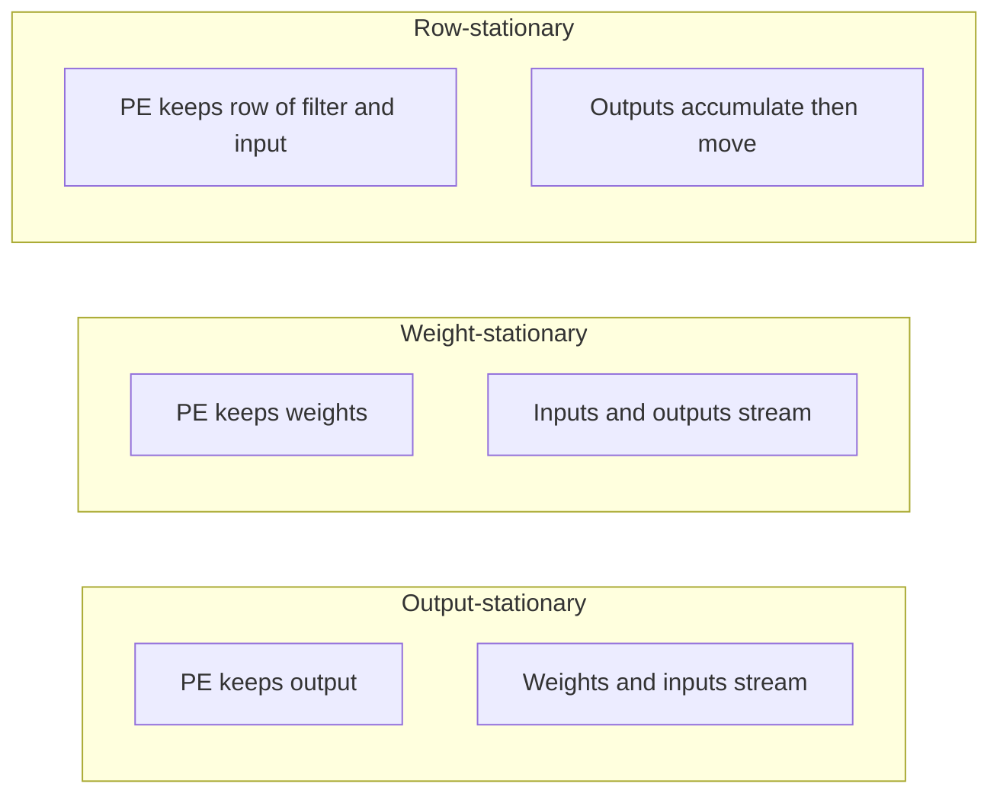
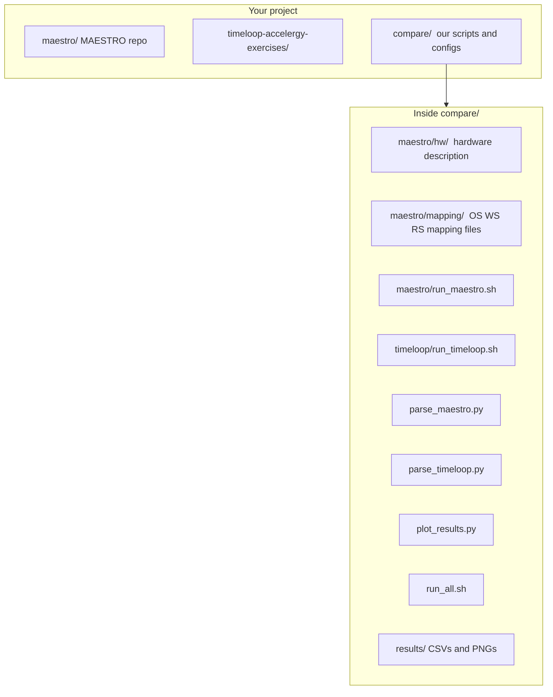
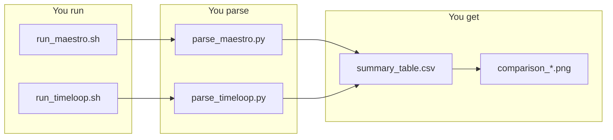
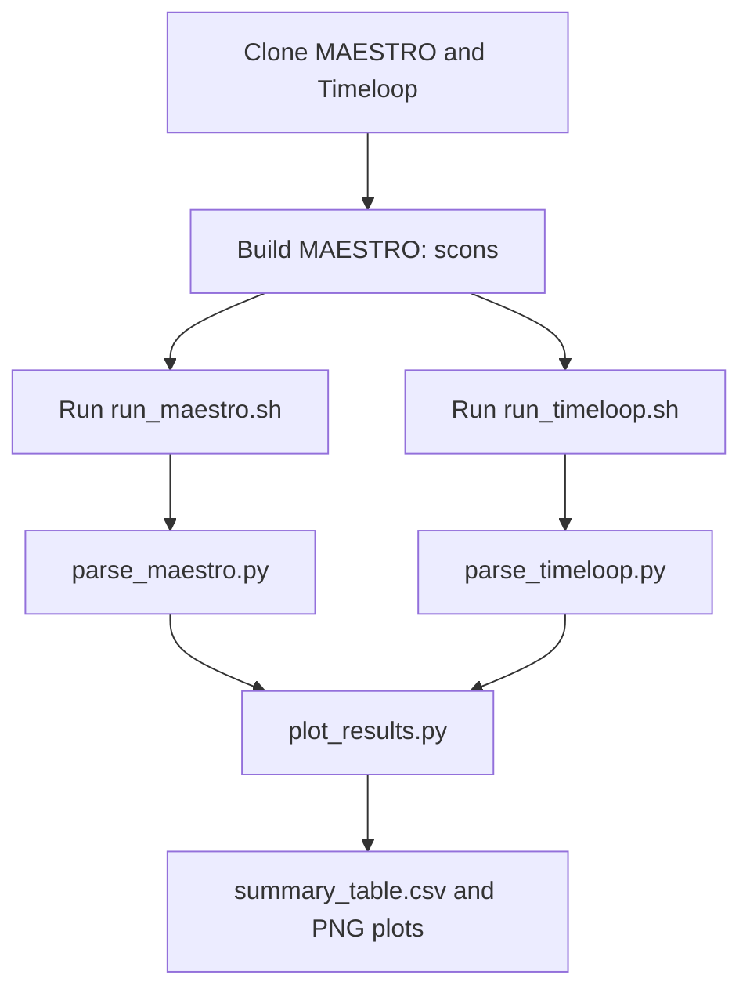

# Notes: Three Dataflows in MAESTRO and Timeloop

Reference: **output-stationary**, **weight-stationary**, and **row-stationary** accelerators (ShiDianNao, NVDLA, Eyeriss), how they are modeled in MAESTRO and Timeloop, and how to reproduce the comparison results.

---

## 1. Overview

The common workload is a **single convolution layer**. The goal is to evaluate how three accelerator styles (output-stationary, weight-stationary, row-stationary) perform under MAESTRO and Timeloop, in terms of predicted latency and energy.



At a high level: the same layer is run with three dataflow styles in two frameworks, and the resulting **latency (cycles)** and **energy** estimates are compared.

---

## 2. Dataflow variants

In a convolution, each PE (processing element) performs multiply-accumulate operations. Three tensors move: **weights**, **inputs**, and **partial sums (outputs)**. A dataflow defines which tensor remains stationary at or near the PE and which tensors are streamed.



| Dataflow | What stays in PE | Who uses it | Idea in one line |
|----------|------------------|-------------|-------------------|
| **Output-stationary** | Partial sums (outputs) | ShiDianNao | Accumulate one output in place; stream weights and inputs. |
| **Weight-stationary** | Weights | NVDLA | Keep weights; stream inputs and partial sums. |
| **Row-stationary** | One filter row × one input row | Eyeriss | Reuse at row granularity; balance all three. |

---

## 3. The three dataflows in one picture



- **OS:** Minimize writing partial sums; good when you want to reuse one output many times.
- **WS:** Minimize weight reads; good when the same filter is used over many positions.
- **RS:** Balance reuse of filter, input, and output; often good for energy on convolutions.

---

## 4. Where is the code? (Project layout)

All code lives under your project root (e.g. `/home/esp2026/kl3755`).



- **MAESTRO:** `compare/maestro/hw/` and `compare/maestro/mapping/` (one `.m` file per dataflow).
- **Timeloop:** We use the exercise designs (OS, WS, Eyeriss); `compare/timeloop/run_timeloop.sh` copies their stats.
- **Comparison:** `parse_maestro.py`, `parse_timeloop.py`, `plot_results.py` produce `results/summary_table.csv` and `results/comparison_*.png`.

---

## 5. Reproduction commands (copy-paste)

Use a terminal. All commands are from the **project root** (the folder that contains `maestro/`, `timeloop/`, and `compare/`).

### Step 0: Go to project root

```bash
cd /home/esp2026/kl3755
```

### Step 1: Build MAESTRO (one time)

If you don’t have `scons` in PATH:

```bash
pip install scons --user
export PATH="$HOME/.local/bin:$PATH"
```

Then build:

```bash
cd maestro
scons
cd ..
```

You should see a binary `maestro/maestro`.

### Step 2: Run MAESTRO for all three dataflows

```bash
chmod +x compare/maestro/run_maestro.sh
./compare/maestro/run_maestro.sh
```

This runs MAESTRO three times (OS, WS, RS) and writes:

- `compare/results/maestro_os_shidiannao.stdout`
- `compare/results/maestro_ws_nvdla.stdout`
- `compare/results/maestro_rs_eyeriss.stdout`

### Step 3: Parse MAESTRO output to CSV

```bash
python3 compare/parse_maestro.py
```

Creates: `compare/results/results_maestro.csv` (columns: dataflow, framework, latency_cycles, energy_mac_units, utilization_pct).

### Step 4: Get Timeloop results

```bash
chmod +x compare/timeloop/run_timeloop.sh
./compare/timeloop/run_timeloop.sh
```

This copies (or runs) Timeloop exercises and writes:

- `compare/results/timeloop_os_shidiannao.stats.txt`
- `compare/results/timeloop_ws_nvdla.stats.txt`
- `compare/results/timeloop_rs_eyeriss.stats.txt`

### Step 5: Parse Timeloop output to CSV

```bash
python3 compare/parse_timeloop.py
```

Creates: `compare/results/results_timeloop.csv`.

### Step 6: Merge and plot

```bash
pip install matplotlib --user
python3 compare/plot_results.py
```

Creates:

- `compare/results/summary_table.csv` (all dataflows and both frameworks)
- `compare/results/comparison_latency_energy.png`
- `compare/results/comparison_edp.png`

### One command to do everything (Steps 2–6)

```bash
./compare/run_all.sh
```

(Make sure `compare/run_all.sh` is executable: `chmod +x compare/run_all.sh`.)

---

## 6. The actual code for each dataflow (MAESTRO)

The **same convolution layer** is used for all three. Only the **Dataflow** block changes.

**Layer dimensions (same everywhere):** K=64, C=64, R=3, S=3, Y=56, X=56 (one 3×3 conv layer).

> K=64, C=64, R=3, S=3, Y=56, X=56
means: 64 input channels → 64 output channels, 3×3 filter, and the output is 56×56.

### Output-stationary (ShiDianNao) — code

File: `compare/maestro/mapping/single_layer_os_shidiannao.m`

```text
Network single_layer {
Layer CONV1 {
	Type: CONV
	Stride { X: 1, Y: 1 }
	Dimensions { K 64, C 64, R 3, S 3, Y 56, X 56 }
	Dataflow {
		TemporalMap(1,1) K;
		TemporalMap(1,1) C;
		SpatialMap(Sz(R), 1) Y;
		TemporalMap(10,8) X;
		TemporalMap(Sz(R), Sz(R)) R;
		TemporalMap(Sz(R), Sz(R)) S;
		Cluster(8, P);
		SpatialMap(Sz(S), 1) X;
		TemporalMap(Sz(R), Sz(R)) S;
	}
}
}
```

- Here we iterate over R, S, C in time and spread over Y (and cluster X), so **one output tile is accumulated in place** → output-stationary.

Temporal = reuse over time at the same PE (looping inside a PE).
Spatial = reuse across different PEs at the same time (parallelism).

TemporalMap(tile, stride) Dim;
→ For a single PE, you iterate Dim in time in chunks of size tile, moving by stride each time. This controls temporal tiling/order and temporal reuse.

SpatialMap(tile, stride) Dim;
→ You split Dim across multiple PEs; each PE gets a chunk of size tile with offset stride between neighbors. This controls how work is spread spatially.

### Weight-stationary (NVDLA) — code

File: `compare/maestro/mapping/single_layer_ws_nvdla.m`

```text
Network single_layer {
Layer CONV1 {
	Type: CONV
	Stride { X: 1, Y: 1 }
	Dimensions { K 64, C 64, R 3, S 3, Y 56, X 56 }
	Dataflow {
		SpatialMap(1,1) C;
		TemporalMap(64,64) K;
		TemporalMap(3,3) R;
		TemporalMap(3,3) S;
		TemporalMap(1,1) Y';
		TemporalMap(1,1) X';
		Cluster(64, P);
		SpatialMap(1,1) K;
		TemporalMap(3,3) R;
		TemporalMap(3,3) S;
	}
}
}
```

- **Weights** are tied to C and K,R,S; we keep them in place (spatial C, temporal K,R,S) and sweep over output space Y',X' → weight-stationary.

### Row-stationary (Eyeriss) — code

File: `compare/maestro/mapping/single_layer_rs_eyeriss.m`

```text
Network single_layer {
Layer CONV1 {
	Type: CONV
	Stride { X: 1, Y: 1 }
	Dimensions { K 64, C 64, R 3, S 3, Y 56, X 56 }
	Dataflow {
		TemporalMap(2,2) K;
		TemporalMap(3,3) C;
		TemporalMap(3,3) R;
		SpatialMap(3,1) Y;
		TemporalMap(3,1) X;
		Cluster(3, P);
		SpatialMap(1,1) X;
		SpatialMap(1,1) R;
		TemporalMap(3,3) S;
	}
}
}
```

- **Row-wise** reuse: temporal K,C,R and spatial Y; cluster and spatial X,R; temporal S → row-stationary style.

---

## 7. How we run MAESTRO (the script)

`compare/maestro/run_maestro.sh` does this for each of OS, WS, RS (conceptually):

```bash
# From repo root; HW and mapping paths point to compare/maestro/
./maestro/maestro --HW_file='compare/maestro/hw/accelerator_1.m' \
                  --Mapping_file='compare/maestro/mapping/single_layer_os_shidiannao.m' \
                  --print_res=true --print_res_csv_file=true --print_log_file=false
```

Same idea for `single_layer_ws_nvdla.m` and `single_layer_rs_eyeriss.m`. The script runs from `maestro/` and uses full paths to the compare files.

---

## 8. Timeloop side (no editing needed)

We **reuse** existing Timeloop exercises:

- **Output-stationary:** exercise `01_os` (2-level conv, OS mapping).
- **Weight-stationary:** exercise `01_ws` (2-level conv, WS mapping).
- **Row-stationary:** exercise `06` (Eyeriss-like architecture and mapper).

`compare/timeloop/run_timeloop.sh` copies the pre-generated `*.stats.txt` from those exercises into `compare/results/`. So you don’t write new YAML by hand; you just run the script.

---

## 9. What the results mean

After Step 6 you have:

- **summary_table.csv:** each row = one (dataflow, framework) with latency_cycles, energy, utilization_pct.
- **comparison_latency_energy.png:** bar chart of latency and energy by dataflow, grouped by framework.
- **comparison_edp.png:** energy × delay (EDP) by dataflow.

**Read the table like this:**

- **Latency (cycles):** lower is faster.
- **Energy:** MAESTRO uses “MAC units”; Timeloop uses µJ. Don’t mix units across frameworks; compare **within** each framework.
- **EDP:** lower is better (better energy efficiency for the same delay).



---

## 10. Full pipeline (one diagram)



---

## Quick reference: commands in order

```bash
cd /home/esp2026/kl3755
pip install scons --user
export PATH="$HOME/.local/bin:$PATH"
cd maestro && scons && cd ..
chmod +x compare/maestro/run_maestro.sh compare/timeloop/run_timeloop.sh compare/run_all.sh
./compare/run_all.sh
```

Then open:

- `compare/results/summary_table.csv`
- `compare/results/comparison_latency_energy.png`
- `compare/results/comparison_edp.png`

For more Mermaid charts (including mindmaps), open **docs/flowcharts.html** in a browser.
