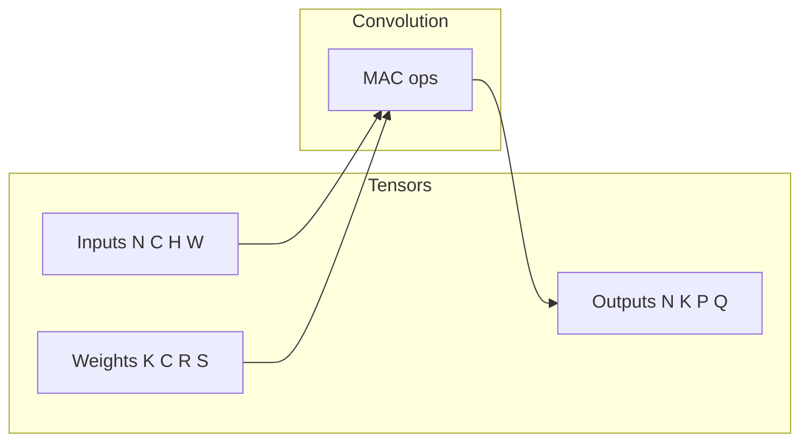
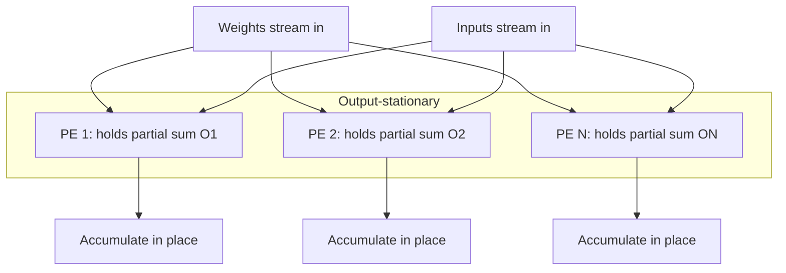
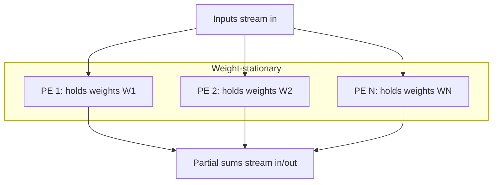
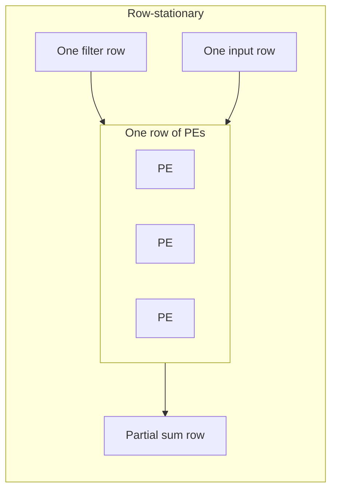
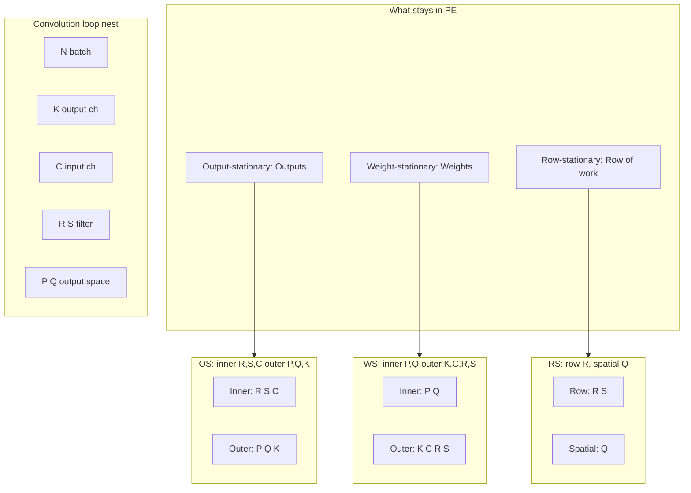
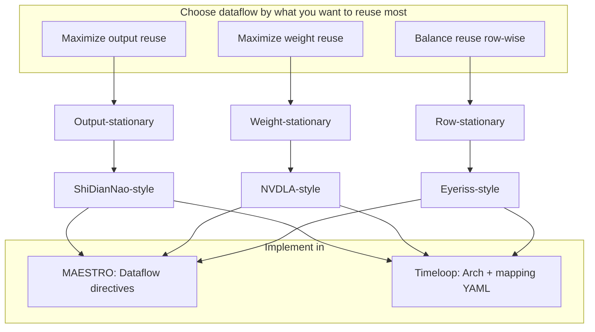

# Notes: DNN Accelerator Dataflows (OS, WS, RS)

Reference for output-, weight-, and row-stationary and how they are expressed in MAESTRO and Timeloop.

## Overview

This document summarizes the three canonical dataflows—**output-stationary** (ShiDianNao), **weight-stationary** (NVDLA), and **row-stationary** (Eyeriss)—and shows how they are expressed and evaluated in MAESTRO and Timeloop.

---

## 1. Convolution and the loop nest

A 2D convolution layer computes:

**Output[n][k][q][p] = Σ (over c,r,s) Input[n][c][q·stride + r][p·stride + s] × Weight[k][c][r][s]**

The dimensions are:

- **N** = batch
- **K** (or **M**) = output channels
- **C** = input channels  
- **R, S** = filter height, width
- **P, Q** = output height, width (Y, X in MAESTRO)



The computation is a **7-dimensional loop nest**. Which tensor we keep **stationary** (reused in place) and which we **stream** determines the dataflow and energy/latency tradeoff.

---

## 2. The three dataflows in detail

### 2.1 Output-stationary (ShiDianNao)

**Idea:** Keep **partial sums (outputs)** in the PE; stream **weights** and **inputs**. Each PE accumulates one (or a tile of) output pixel(s) over many multiply-adds before writing back.



**Loop order (conceptually):** Inner loops over **R, S, C** (and possibly K) so that one output tile is fully accumulated before moving. Outer loops over **P, Q, K** (output space). Spatially, different PEs handle different output indices (e.g. different K or P,Q).

| Aspect | Description |
|--------|-------------|
| **Stationary** | Output / partial sum |
| **Streaming** | Weights, inputs |
| **Reuse** | Maximizes output (psum) reuse; fewer writes to memory |
| **Typical use** | ShiDianNao-style accelerators, output-channel or spatial parallelism |

---

### 2.2 Weight-stationary (NVDLA)

**Idea:** Keep **weights** in the PE (or local buffer); stream **inputs** and **partial sums**. The same weight block is reused for many input/output positions.



**Loop order (conceptually):** Inner loops over **P, Q** (and possibly N) so the same weight block is reused across output positions. Spatially, different PEs often hold different **K** (or C) slices. Weights are loaded once and reused.

| Aspect | Description |
|--------|-------------|
| **Stationary** | Weights |
| **Streaming** | Inputs, outputs (partial sums) |
| **Reuse** | Maximizes weight reuse; good when filters are large or reused often |
| **Typical use** | NVDLA-style pipelines, weight prefetch and reuse |

---

### 2.3 Row-stationary (Eyeriss)

**Idea:** Reuse at the granularity of **one filter row × one input row**. Reduces partial-sum storage and balances filter reuse, input reuse, and psum accumulation (row-stationary, not full output or full weight).



**Loop order (conceptually):** Row-wise tiling: e.g. inner loops over **R** (one filter row) and corresponding **input row**; spatial mapping over **Q** (or P) for rows. Eyeriss uses separate scratchpads for inputs, weights, and psums inside each PE and exploits all three reuse types in a balanced way.

| Aspect | Description |
|--------|-------------|
| **Stationary** | A “row” of work (filter row × input row) |
| **Streaming** | Other dimensions; psums accumulated and then moved |
| **Reuse** | Balanced filter, input, and psum reuse; often best energy for conv |
| **Typical use** | Eyeriss, Eyeriss v2 |

---

## 3. One picture for all three



---

## 4. Accelerator–dataflow mapping

| Dataflow | Accelerator | MAESTRO mapping style | Timeloop idea |
|----------|-------------|------------------------|---------------|
| Output-stationary | **ShiDianNao** | YXP / YKP: spatial over Y (or P), temporal R,S,C | Keep Outputs at PE; inner permutation R,S,C |
| Weight-stationary | **NVDLA** | CKP / XP: spatial K or C, temporal P,Q | Keep Weights at PE; inner permutation P,Q |
| Row-stationary | **Eyeriss** | RS: temporal K,C,R; spatial Y,X; cluster | Separate ifmap/weight/psum spads; row-wise factors |

---

## 5. Implementation (Timeloop)

### Step 1: Set up the repos and workload

You already have:

- `maestro/` — MAESTRO cost model
- `timeloop/` — Timeloop (NVlabs)
- `timeloop-accelergy-exercises/` — exercises with Eyeriss-like and other examples

**Shared workload:** Pick one convolution layer so MAESTRO and Timeloop use the same dimensions. Example:

- **K=64, C=64, R=3, S=3, P=56, Q=56, N=1** (one 3×3 conv layer).

In MAESTRO this is `Dimensions { K 64, C 64, R 3, S 3, Y 56, X 56 }` (Y=P, X=Q). In Timeloop this is `instance: { M: 64, C: 64, R: 3, S: 3, P: 56, Q: 56, N: 1 }` (M=K).

---

### Step 2: MAESTRO — build and run

1. **Build MAESTRO** (from repo root):
   ```bash
   cd /home/esp2026/kl3755/maestro
   # If SCons/scons is used:
   scons
   # Or follow README for your platform
   ```
2. **Hardware file:** Use `data/hw/accelerator_1.m` (or create one). Example content:
   ```
   num_pes: 256
   l1_size_cstr: 100
   l2_size_cstr: 3000
   noc_bw_cstr: 1000
   offchip_bw_cstr: 50
   ```
3. **Mapping files:** MAESTRO uses **Dataflow** blocks with:
   - `TemporalMap(tile, stride) Dim` — temporal loop over dimension
   - `SpatialMap(tile, stride) Dim` — spatial map across PEs
   - `Cluster(size, P)` — cluster size for dimension P

   **Output-stationary (ShiDianNao-like):** Use existing style from `vgg16_yxp_os.m` or `Resnet50_yxp_os.m`: temporal K,C; spatial on Y (or R); temporal X,R,S; Cluster; spatial S; temporal R,S. So **outputs** are accumulated in place (inner R,S,C).

   **Weight-stationary (NVDLA-like):** Use `vgg16_ckp_ws.m` or `Resnet50_kcp_ws.m`: SpatialMap(1,1) C; TemporalMap on K; TemporalMap R,S; TemporalMap Y',X'; Cluster; SpatialMap K; TemporalMap R,S. So **weights** stay (spatial C, temporal K,R,S).

   **Row-stationary (Eyeriss-like):** Use `vgg16_rs.m` or `Resnet50_rs.m`: TemporalMap on K,C,R; SpatialMap on Y; TemporalMap on X; Cluster; SpatialMap X,R; TemporalMap S. **Row** of filter × input is the unit of reuse.

4. **Run** (one mapping at a time):
   ```bash
   ./maestro --HW_file='data/hw/accelerator_1.m' \
             --Mapping_file='data/mapping/vgg16_yxp_os.m' \
             --print_res=true --print_res_csv_file=true
   ```
   Repeat for `vgg16_ckp_ws.m` and `vgg16_rs.m` (or your own files with the same layer dimensions). Save stdout or CSV for **latency, energy, buffer/NoC** stats.

---

### Step 3: Timeloop — problem, architecture, mapping

1. **Problem YAML:** Define the same conv layer. Dimensions: N, M(K), C, R, S, P, Q; data spaces: Weights, Inputs, Outputs (with convolution projections). See `timeloop-accelergy-exercises/workspace/tutorial_exercises/02_interface_and_design_space_exploration_2024/inputs/problem.yaml` for shape and coefficients (stride, dilation).

2. **Architecture YAML:** Hierarchical: DRAM → global buffer → PE array → PE (optional register/scratchpads) → MAC.
   - **Output-stationary (ShiDianNao-like):** One buffer level that **keeps Outputs** at PE (e.g. `dataspace: {keep: [Outputs]}` at PE/reg). Mapping: inner **temporal** permutation R,S,C (and factors); **spatial** over K and/or P,Q.
   - **Weight-stationary (NVDLA-like):** PE (or reg) **keeps Weights** (`keep: [Weights]`). Inner temporal permutation P,Q (and factors); spatial over K (and/or C). You can start from Timeloop’s NVDLA example if available in the exercises.
   - **Row-stationary (Eyeriss-like):** Use the Eyeriss-like example under `timeloop-accelergy-exercises/workspace/tutorial_exercises/01_accelergy_timeloop_2020_ispass/timeloop/06-mapper-convlayer-eyeriss/arch/eyeriss_like.yaml`: shared_glb (bypass Weights), PE_column / PE spatial, and inside PE **three scratchpads** (ifmap, weights, psum) with `keep: [Inputs]`, `keep: [Weights]`, `keep: [Outputs]` and row-oriented permutation/factors.

3. **Mapping:** In Timeloop v4, mapping can be given explicitly or found by the **mapper**. For a fixed comparison, either:
   - Provide a **mapping** YAML (temporal/spatial directives with permutation and factors per level), or  
   - Run **timeloop-mapper** with the same problem + architecture and record the best mapping’s stats.

4. **Run** (example with mapper):
   ```bash
   cd /home/esp2026/kl3755/timeloop-accelergy-exercises/workspace/tutorial_exercises/01_accelergy_timeloop_2020_ispass/timeloop
   python3 run_example.py 06
   ```
   Or use the Timeloop binary from the main `timeloop` repo with your `problem.yaml` + `arch.yaml` + optional `mapping.yaml`. Collect **latency (cycles), energy, utilization** from the output (e.g. stats or Accelergy reports).

---

### Step 4: Compare predicted performance

1. **Same workload:** One conv layer, same N,K,C,R,S,P,Q in both tools.
2. **Metrics:**
   - **Latency** (cycles or time)
   - **Energy** (total or per data space)
   - **Utilization** (e.g. PE utilization from Timeloop; MAESTRO reuse/occupancy if available)
3. **Table:** Build a small table:

   | Dataflow | Framework | Latency | Energy | Utilization |
   |----------|-----------|---------|--------|--------------|
   | Output-stationary (ShiDianNao) | MAESTRO | ... | ... | ... |
   | Output-stationary (ShiDianNao) | Timeloop | ... | ... | ... |
   | Weight-stationary (NVDLA)     | MAESTRO | ... | ... | ... |
   | Weight-stationary (NVDLA)     | Timeloop | ... | ... | ... |
   | Row-stationary (Eyeriss)       | MAESTRO | ... | ... | ... |
   | Row-stationary (Eyeriss)       | Timeloop | ... | ... | ... |

4. **Optional:** Plot latency and EDP (energy × delay) per dataflow for each framework to see which dataflow each tool predicts as best for your layer.

---

## 6. Dataflow decision view (Mermaid)



---

## Summary

- **Output-stationary (ShiDianNao):** Outputs stay in PE; inner loops R,S,C; good psum reuse.
- **Weight-stationary (NVDLA):** Weights stay in PE; inner loops P,Q; good weight reuse.
- **Row-stationary (Eyeriss):** Row of filter × row of input; separate ifmap/weight/psum spads; balanced reuse.

Implement each in MAESTRO (mapping + HW file) and Timeloop (problem + architecture + mapping), run the **same conv layer**, and compare **latency, energy, and utilization** in a table (and optionally plots) to see how the two frameworks rank the three dataflows.
