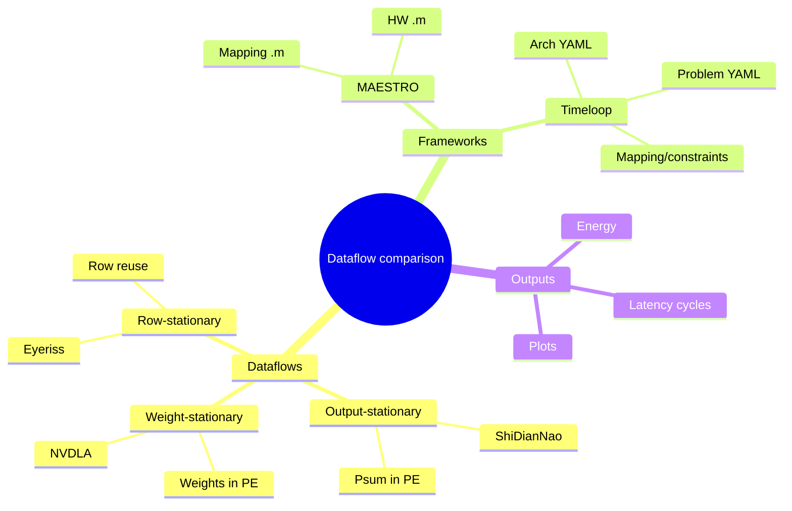
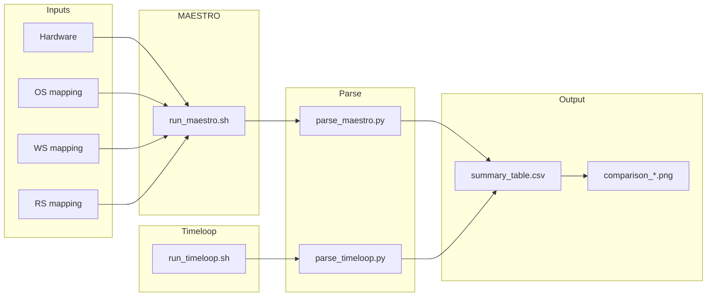
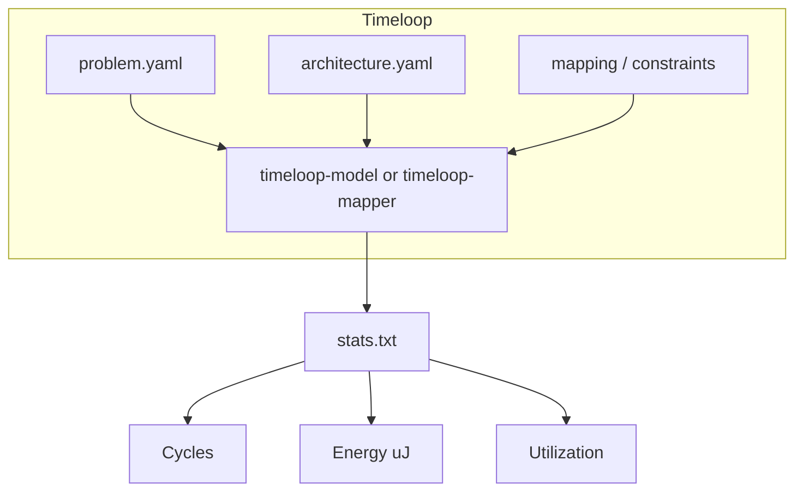
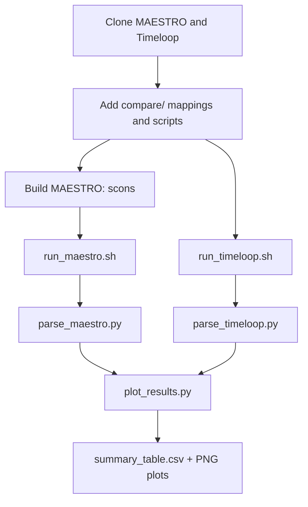

# Notes: Implementation (OS, WS, RS in MAESTRO and Timeloop)

Reference for reproducing the comparison pipeline (mappings, scripts, parsers, plots).

This document records the implementation details needed to reproduce the comparison between output-stationary (ShiDianNao), weight-stationary (NVDLA), and row-stationary (Eyeriss) in MAESTRO and Timeloop.

---

## Mindmap: What we are building



---

## Overview flowchart



---

## Step 1: Directory layout and files

After cloning MAESTRO and Timeloop, the project looks like this:

```
kl3755/
├── maestro/                    # MAESTRO repo
├── timeloop/                   # NVlabs Timeloop repo
├── timeloop-accelergy-exercises/
├── compare/
│   ├── maestro/
│   │   ├── hw/accelerator_1.m
│   │   ├── mapping/
│   │   │   ├── single_layer_os_shidiannao.m
│   │   │   ├── single_layer_ws_nvdla.m
│   │   │   └── single_layer_rs_eyeriss.m
│   │   └── run_maestro.sh
│   ├── timeloop/
│   │   └── run_timeloop.sh
│   ├── results/                # created by scripts
│   ├── parse_maestro.py
│   ├── parse_timeloop.py
│   ├── plot_results.py
│   └── run_all.sh
└── docs/
    ├── Notes_Dataflows_Technical.md
    ├── flowcharts.html
    └── Notes_Implementation.md  (this file)
```

---

## Step 2: MAESTRO — dataflow in code

MAESTRO expresses dataflow with **Dataflow { ... }** inside each layer. Dimensions are **K, C, R, S, Y, X** (Y = output height, X = output width).

### Output-stationary (ShiDianNao)

**Idea:** Inner loops over R, S, C so one output tile is accumulated in place; spatial over Y (and cluster over X).

**Code (single layer):** `compare/maestro/mapping/single_layer_os_shidiannao.m`

```text
Network single_layer {
Layer CONV1 {
	Type: CONV
	Stride { X: 1, Y: 1 }
	Dimensions { K 64, C 64, R 3, S 3, Y 56, X 56 }
	Dataflow {
		TemporalMap(1,1) K;
		TemporalMap(1,1) C;
		SpatialMap(Sz(R), 1) Y;
		TemporalMap(10,8) X;
		TemporalMap(Sz(R), Sz(R)) R;
		TemporalMap(Sz(R), Sz(R)) S;
		Cluster(8, P);
		SpatialMap(Sz(S), 1) X;
		TemporalMap(Sz(R), Sz(R)) S;
	}
}
}
```

### Weight-stationary (NVDLA)

**Idea:** Weights stay; spatial C, temporal K,R,S; inner temporal over P,Q (Y',X').

**Code:** `compare/maestro/mapping/single_layer_ws_nvdla.m`

```text
Dataflow {
	SpatialMap(1,1) C;
	TemporalMap(64,64) K;
	TemporalMap(3,3) R;
	TemporalMap(3,3) S;
	TemporalMap(1,1) Y';
	TemporalMap(1,1) X';
	Cluster(64, P);
	SpatialMap(1,1) K;
	TemporalMap(3,3) R;
	TemporalMap(3,3) S;
}
```

### Row-stationary (Eyeriss)

**Idea:** Row-wise reuse: temporal K,C,R; spatial Y; cluster; spatial X,R; temporal S.

**Code:** `compare/maestro/mapping/single_layer_rs_eyeriss.m`

```text
Dataflow {
	TemporalMap(2,2) K;
	TemporalMap(3,3) C;
	TemporalMap(3,3) R;
	SpatialMap(3,1) Y;
	TemporalMap(3,1) X;
	Cluster(3, P);
	SpatialMap(1,1) X;
	SpatialMap(1,1) R;
	TemporalMap(3,3) S;
}
```

---

## Step 3: Run MAESTRO

**3.1 Build MAESTRO (once):**

```bash
cd /home/esp2026/kl3755/maestro
scons
```

**3.2 Run all three mappings and save stdout:**

```bash
cd /home/esp2026/kl3755
./compare/maestro/run_maestro.sh
```

This runs `maestro` with `--HW_file=compare/maestro/hw/accelerator_1.m` and each of the three mapping files, and writes `compare/results/maestro_os_shidiannao.stdout`, `maestro_ws_nvdla.stdout`, `maestro_rs_eyeriss.stdout`.

**3.3 Parse MAESTRO output to CSV:**

```bash
python3 compare/parse_maestro.py
```

This looks for `Runtime: ... cycles` and `Total energy consumption: ... X MAC energy` in each stdout and writes `compare/results/results_maestro.csv`.

---

## Step 4: Timeloop — where OS, WS, RS live

Timeloop uses **architecture YAML** (buffer hierarchy, PE array) and **mapping/constraints** (loop permutation and factors). Dataflow is expressed by **which tensor is kept at which level** and the **loop order**.



- **Output-stationary:** PE/register **keeps Outputs**; inner temporal permutation R,S,C.
- **Weight-stationary:** PE/register **keeps Weights**; inner temporal P,Q.
- **Row-stationary (Eyeriss):** Separate ifmap/weight/psum scratchpads; row-oriented factors (see exercise 06).

We use the **timeloop-accelergy-exercises**: exercise **01** (OS and WS) and **06** (Eyeriss).

---

## Step 5: Run Timeloop

**5.1 Copy pre-generated stats (no Python env needed):**

```bash
./compare/timeloop/run_timeloop.sh
```

This copies from `.../01-model-conv1d-2level/ref-output/os/timeloop-model.stats.txt` and `.../ws/...` and `.../06-mapper-convlayer-eyeriss/ref-output/timeloop-mapper.stats.txt` into `compare/results/timeloop_os_shidiannao.stats.txt`, `timeloop_ws_nvdla.stats.txt`, `timeloop_rs_eyeriss.stats.txt`. If ref-output is missing, the script can run `python3 run_example.py 01_os 01_ws 06` (requires `pytimeloop`).

**5.2 Parse Timeloop stats to CSV:**

```bash
python3 compare/parse_timeloop.py
```

This parses `Cycles:`, `Energy: ... uJ`, `Utilization: ...%` from each stats file and writes `compare/results/results_timeloop.csv`.

---

## Step 6: Compare and plot

**6.1 Merge and plot:**

```bash
python3 compare/plot_results.py
```

This script:

- Reads `results_maestro.csv` and `results_timeloop.csv`
- Writes `compare/results/summary_table.csv` (all rows: dataflow, framework, latency_cycles, energy, utilization_pct)
- Draws two bar charts (if matplotlib is installed):
  - **comparison_latency_energy.png** — latency and energy by dataflow, grouped by framework
  - **comparison_edp.png** — energy-delay product by dataflow

**6.2 One-shot run (MAESTRO + Timeloop + parse + plot):**

```bash
./compare/run_all.sh
```

---

## Step 7: How to read the results

| Column / plot | Meaning |
|---------------|--------|
| **dataflow** | ShiDianNao_OS, NVDLA_WS, Eyeriss_RS |
| **framework** | MAESTRO or Timeloop |
| **latency_cycles** | Execution cycles (lower is better) |
| **energy** | MAESTRO: “X MAC energy”; Timeloop: µJ (not directly comparable across frameworks) |
| **utilization_pct** | PE utilization (Timeloop; MAESTRO may be 0 if not printed) |
| **EDP** | Latency × energy (lower is better) |

Plots compare the three dataflows **within** each framework. Do not compare MAESTRO energy (MAC units) to Timeloop energy (µJ) numerically; use them for relative ranking per framework.

---

## Mermaid: Full pipeline



---

## Quick reference: commands in order

```bash
# From repo root: /home/esp2026/kl3755
cd /home/esp2026/kl3755

# Build MAESTRO (once)
cd maestro && scons && cd ..

# Run everything
./compare/run_all.sh

# Or step by step:
./compare/maestro/run_maestro.sh
python3 compare/parse_maestro.py
./compare/timeloop/run_timeloop.sh
python3 compare/parse_timeloop.py
python3 compare/plot_results.py

# Results
ls compare/results/
# summary_table.csv  comparison_latency_energy.png  comparison_edp.png
```

This gives you the full implementation with code and Mermaid charts. For the concepts behind OS, WS, and RS, see [Notes_Dataflows_Technical.md](Notes_Dataflows_Technical.md) and [flowcharts.html](flowcharts.html).
